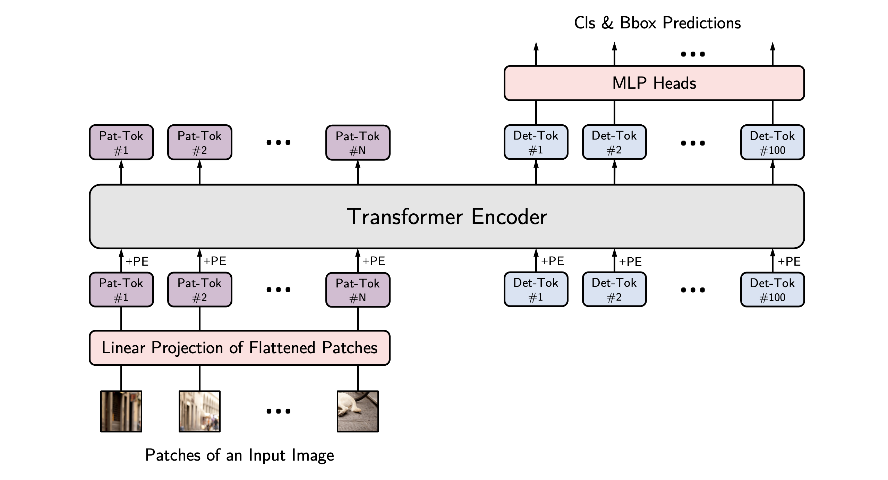
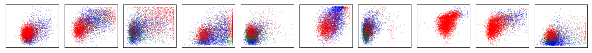
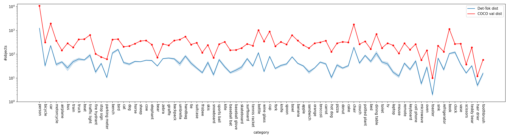
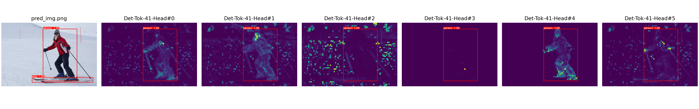
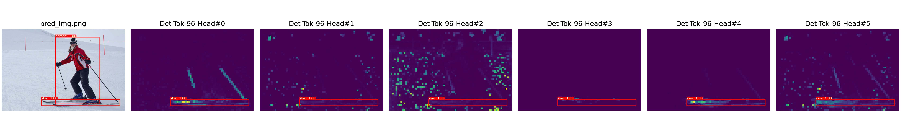

<div align="center">   
  
# You Only :eyes: One Sequence
</div>

**TL;DR:**  We study the transferability of the vanilla ViT pre-trained on mid-sized ImageNet-1k to the more challenging COCO object detection benchmark.

:man_technologist: This project is under active development :woman_technologist: :

* **`May 4, 2022`:** :eyes:YOLOS is now available in [🤗HuggingFace Transformers](https://huggingface.co/docs/transformers/main/en/model_doc/yolos)!

* **`Apr 8, 2022`:** If you like YOLOS, you might also like MIMDet ([paper](https://arxiv.org/abs/2204.02964) / [code & models](https://github.com/hustvl/MIMDet))! MIMDet can efficiently and effectively adapt a masked image modeling (MIM) pre-trained vanilla Vision Transformer (ViT) for high-performance object detection (51.5 box AP and 46.0 mask AP on COCO using ViT-Base & Mask R-CNN).

* **`Oct 28, 2021`:** YOLOS receives an update for [the NeurIPS 2021 camera-ready version](https://arxiv.org/abs/2106.00666v3). We add MoCo-v3 self-supervised pre-traineing results, study the impacts of detaching `[Det]` tokens, as well as add a new Discussion Section.  

* **`Sep 29, 2021`:** **YOLOS is accepted to NeurIPS 2021!**

* **`Jun 22, 2021`:**  We update our [manuscript](https://arxiv.org/pdf/2106.00666.pdf) on arXiv including discussion about position embeddings and more visualizations, check it out!

* **`Jun 9, 2021`:**  We add a [notebook](VisualizeAttention.ipynb) to to visualize self-attention maps of `[Det]` tokens on different heads of the last layer, check it out!

# 

> [**You Only Look at One Sequence: Rethinking Transformer in Vision through Object Detection**](https://arxiv.org/abs/2106.00666)
>
> by [Yuxin Fang](https://scholar.google.com/citations?user=_Lk0-fQAAAAJ&hl=en)<sup>1</sup> \*, Bencheng Liao<sup>1</sup> \*, [Xinggang Wang](https://xinggangw.info/)<sup>1 :email:</sup>, [Jiemin Fang](https://jaminfong.cn)<sup>2, 1</sup>, Jiyang Qi<sup>1</sup>, [Rui Wu](https://scholar.google.com/citations?hl=en&user=Z_ZkkbEAAAAJ&view_op=list_works&citft=1&email_for_op=2yuxinfang%40gmail.com&gmla=AJsN-F6AJfvX_wN_jDDdJOp33cW5LrvrAwATh1FFyrUxKD8H354RTN7gMFIXi4NTozHvdj1ITW1q5sNS3ED-3htZJpnUA9BraZa8Wnc_XSfCR37MriE77bh9KHFTKml-qPSgNTPdxwFl8KHxIgOWc_ZuJdvo8cbBWc_Ec3SBL6n7wsYYS2E1Wzm4kWwXQybOJCGjI8_EwHwwipOfkQR9I2C_Riq1gk1Y_JG3BQ3xrTy2fN_plPE37StUe_nOnrTjUz919wcMXKqW)<sup>3</sup>, Jianwei Niu<sup>3</sup>, [Wenyu Liu](http://eic.hust.edu.cn/professor/liuwenyu/)<sup>1</sup>.
> 
> <sup>1</sup> [School of EIC, HUST](http://eic.hust.edu.cn/English/Home.htm), <sup>2</sup> Institute of AI, HUST, <sup>3</sup> [Horizon Robotics](https://en.horizon.ai).
> 
> (\*) equal contribution, (<sup>:email:</sup>) corresponding author.
> 
> *arXiv technical report ([arXiv 2106.00666](https://arxiv.org/abs/2106.00666))*

<br>

## You Only Look at One Sequence (YOLOS)

### The Illustration of YOLOS


### Highlights

Directly inherited from [ViT](https://arxiv.org/abs/2010.11929) ([DeiT](https://arxiv.org/abs/2012.12877)), YOLOS is not designed to be yet another high-performance object detector, but to unveil the versatility and transferability of Transformer from image recognition to object detection.
Concretely, our main contributions are summarized as follows:

* We use the mid-sized `ImageNet-1k` as the sole pre-training dataset, and show that a vanilla [ViT](https://arxiv.org/abs/2010.11929) ([DeiT](https://arxiv.org/abs/2012.12877)) can be successfully transferred to perform the challenging object detection task and produce competitive `COCO` results with the fewest possible modifications, _i.e._, by only looking at one sequence (YOLOS).

* We demonstrate that 2D object detection can be accomplished in a pure sequence-to-sequence manner by taking a sequence of fixed-sized non-overlapping image patches as input. Among existing object detectors, YOLOS utilizes minimal 2D inductive biases. Moreover, it is feasible for YOLOS to perform object detection in any dimensional space unaware the exact spatial structure or geometry.

* For [ViT](https://arxiv.org/abs/2010.11929) ([DeiT](https://arxiv.org/abs/2012.12877)), we find the object detection results are quite sensitive to the pre-train scheme and the detection performance is far from saturating. Therefore the proposed YOLOS can be used as a challenging benchmark task to evaluate different pre-training strategies for [ViT](https://arxiv.org/abs/2010.11929) ([DeiT](https://arxiv.org/abs/2012.12877)).

* We also discuss the impacts as wel as the limitations of prevalent pre-train schemes and model scaling strategies for Transformer in vision through transferring to object detection.

### Results
|Model |Pre-train Epochs |  ViT (DeiT) Weight / Log| Fine-tune Epochs | Eval Size | YOLOS Checkpoint / Log | AP @ COCO val |
| :------------: | :------------: | :------------: | :------------: | :------------: | :------------: | :------------: |
|`YOLOS-Ti`|300|[FB](https://dl.fbaipublicfiles.com/deit/deit_tiny_patch16_224-a1311bcf.pth)|300|512|[Baidu Drive](https://pan.baidu.com/s/17kn_UX1LhsjRWxeWEwgWIw), [Google Drive](https://drive.google.com/file/d/1P2YbnAIsEOOheAPr3FGkAAD7pPuN-2Mn/view?usp=sharing) / [Log](https://gist.github.com/Yuxin-CV/aaf4f835f5fdba4b58217f0e3131e9da)|28.7
|`YOLOS-S`|200|[Baidu Drive](https://pan.baidu.com/s/1LsxtuxSGGj5szZssoyzr_Q), [Google Drive](https://drive.google.com/file/d/1waIu4QODBu79JuIwMvchpezrP4nd3NQr/view?usp=sharing) / [Log](https://gist.github.com/Yuxin-CV/98168420dbcc5a0d1e656da83c6bf416)|150|800|[Baidu Drive](https://pan.baidu.com/s/1m39EKyO_7RdIYjDY4Ew_lw), [Google Drive](https://drive.google.com/file/d/1kfHJnC29MqEaizR-d57tzpAxQVhoYRlh/view?usp=sharing) / [Log](https://gist.github.com/Yuxin-CV/ab06dd0d5034e501318de2e9aba9a6fb)|36.1
|`YOLOS-S`|300|[FB](https://dl.fbaipublicfiles.com/deit/deit_small_patch16_224-cd65a155.pth)|150|800|[Baidu Drive](https://pan.baidu.com/s/12v6X-r4XhV5nEXF6yNfGRg), [Google Drive](https://drive.google.com/file/d/1GUB16Zt1BUsT-LeHa8oHTE2CwL7E92VY/view?usp=sharing) / [Log](https://gist.github.com/Yuxin-CV/42d733e478c76f686f2b52cf50dfe59d)|36.1
|`YOLOS-S (dWr)`|300|[Baidu Drive](https://pan.baidu.com/s/1XVfWJk5BFnxIQ3LQeAQypw), [Google Drive](https://drive.google.com/file/d/1uucdzz65lnv-vGFQunTgYSWl7ayJIDgn/view?usp=sharing) / [Log](https://gist.github.com/Yuxin-CV/e3beedccff156b0065f2eb559a4818d3)|150|800|[Baidu Drive](https://pan.baidu.com/s/1Xk2KbFadSwCOjo7gcoSG0w), [Google Drive](https://drive.google.com/file/d/1vBJVXqazsOoHHMZ6Vg6-MpAkYWstLczQ/view?usp=sharing) / [Log](https://gist.github.com/Yuxin-CV/043ea5d27883a6ff1f105ad5d9ddaa46) |37.6
|`YOLOS-B`|1000|[FB](https://dl.fbaipublicfiles.com/deit/deit_base_distilled_patch16_384-d0272ac0.pth)|150|800|[Baidu Drive](https://pan.baidu.com/s/1IKGoAlwcdoV25cU5Cs-kew), [Google Drive](https://drive.google.com/file/d/1AUCedyYT2kxgHJNi3UA23P2UNTreGj3_/view?usp=sharing) / [Log](https://gist.github.com/Yuxin-CV/d5f7720a5868563619ddd64d61760e2f)|42.0

**Notes**: 

- The access code for `Baidu Drive` is `yolo`. 
- The `FB` stands for model weights provided by DeiT ([paper](https://arxiv.org/abs/2012.12877), [code](https://github.com/facebookresearch/deit)). Thanks for their wonderful works.
- We will update other models in the future, please stay tuned :) 

### Requirement
This codebase has been developed with python version 3.6, PyTorch 1.5+ and torchvision 0.6+:
```setup
conda install -c pytorch pytorch torchvision
```
Install pycocotools (for evaluation on COCO) and scipy (for training):
```setup
conda install cython scipy
pip install -U 'git+https://github.com/cocodataset/cocoapi.git#subdirectory=PythonAPI'
```

### Data preparation
Download and extract COCO 2017 train and val images with annotations from http://cocodataset.org. We expect the directory structure to be the following:
```
path/to/coco/
  annotations/  # annotation json files
  train2017/    # train images
  val2017/      # val images
```
### Training
Before finetuning on COCO, you need download the ImageNet pretrained model to the `/path/to/YOLOS/` directory
<details>
<summary>To train the <code>YOLOS-Ti</code> model in the paper, run this command:</summary>
<pre><code>
python -m torch.distributed.launch \
    --nproc_per_node=8 \
    --use_env main.py \
    --coco_path /path/to/coco
    --batch_size 2 \
    --lr 5e-5 \
    --epochs 300 \
    --backbone_name tiny \
    --pre_trained /path/to/deit-tiny.pth\
    --eval_size 512 \
    --init_pe_size 800 1333 \
    --output_dir /output/path/box_model
</code></pre>
</details>

<details>
<summary>To train the <code>YOLOS-S</code> model with 200 epoch pretrained Deit-S in the paper, run this command:</summary>
<pre><code>

python -m torch.distributed.launch \
    --nproc_per_node=8 \
    --use_env main.py \
    --coco_path /path/to/coco
    --batch_size 1 \
    --lr 2.5e-5 \
    --epochs 150 \
    --backbone_name small \
    --pre_trained /path/to/deit-small-200epoch.pth\
    --eval_size 800 \
    --init_pe_size 512 864 \
    --mid_pe_size 512 864 \
    --output_dir /output/path/box_model

</code></pre>
</details>

<details>
<summary>To train the <code>YOLOS-S</code> model with 300 epoch pretrained Deit-S in the paper, run this command:</summary>
<pre><code>
python -m torch.distributed.launch \
    --nproc_per_node=8 \
    --use_env main.py \
    --coco_path /path/to/coco
    --batch_size 1 \
    --lr 2.5e-5 \
    --epochs 150 \
    --backbone_name small \
    --pre_trained /path/to/deit-small-300epoch.pth\
    --eval_size 800 \
    --init_pe_size 512 864 \
    --mid_pe_size 512 864 \
    --output_dir /output/path/box_model

</code></pre>
</details>

<details>
<summary>To train the <code>YOLOS-S (dWr)</code> model in the paper, run this command:</summary>
<pre><code>
python -m torch.distributed.launch \
    --nproc_per_node=8 \
    --use_env main.py \
    --coco_path /path/to/coco
    --batch_size 1 \
    --lr 2.5e-5 \
    --epochs 150 \
    --backbone_name small_dWr \
    --pre_trained /path/to/deit-small-dWr-scale.pth\
    --eval_size 800 \
    --init_pe_size 512 864 \
    --mid_pe_size 512 864 \
    --output_dir /output/path/box_model
</code></pre>
</details>

<details>
<summary>To train the <code>YOLOS-B</code> model in the paper, run this command:</summary>
<pre><code>
python -m torch.distributed.launch \
    --nproc_per_node=8 \
    --use_env main.py \
    --coco_path /path/to/coco
    --batch_size 1 \
    --lr 2.5e-5 \
    --epochs 150 \
    --backbone_name base \
    --pre_trained /path/to/deit-base.pth\
    --eval_size 800 \
    --init_pe_size 800 1344 \
    --mid_pe_size 800 1344 \
    --output_dir /output/path/box_model
</code></pre>
</details>


### Evaluation

To evaluate `YOLOS-Ti` model on COCO, run:

```eval
python -m torch.distributed.launch --nproc_per_node=8 --use_env main.py --coco_path /path/to/coco --batch_size 2 --backbone_name tiny --eval --eval_size 512 --init_pe_size 800 1333 --resume /path/to/YOLOS-Ti
```
To evaluate `YOLOS-S` model on COCO, run:
```eval
python -m torch.distributed.launch --nproc_per_node=8 --use_env main.py --coco_path /path/to/coco --batch_size 1 --backbone_name small --eval --eval_size 800 --init_pe_size 512 864 --mid_pe_size 512 864 --resume /path/to/YOLOS-S
```
To evaluate `YOLOS-S (dWr)` model on COCO, run:
```eval
python -m torch.distributed.launch --nproc_per_node=8 --use_env main.py --coco_path /path/to/coco --batch_size 1 --backbone_name small_dWr --eval --eval_size 800 --init_pe_size 512 864 --mid_pe_size 512 864 --resume /path/to/YOLOS-S(dWr)
```

To evaluate `YOLOS-B` model on COCO, run:
```eval
python -m torch.distributed.launch --nproc_per_node=8 --use_env main.py --coco_path /path/to/coco --batch_size 1 --backbone_name base --eval --eval_size 800 --init_pe_size 800 1344 --mid_pe_size 800 1344 --resume /path/to/YOLOS-B
```

### Visualization

* **Visualize box prediction and object categories distribution:**


1. To Get visualization in the paper, you need the finetuned YOLOS models on COCO, run following command to get 100 Det-Toks prediction on COCO val split, then it will generate `/path/to/YOLOS/visualization/modelname-eval-800-eval-pred.json`
```
python cocoval_predjson_generation.py --coco_path /path/to/coco --batch_size 1 --backbone_name small --eval --eval_size 800 --init_pe_size 512 864 --mid_pe_size 512 864 --resume /path/to/yolos-s-model.pth --output_dir ./visualization
```
2. To get all ground truth object categories on all images from COCO val split, run following command to generate `/path/to/YOLOS/visualization/coco-valsplit-cls-dist.json`
```
python cocoval_gtclsjson_generation.py --coco_path /path/to/coco --batch_size 1 --output_dir ./visualization
```
3. To visualize the distribution of Det-Toks' bboxs and categories, run following command to generate `.png` files in `/path/to/YOLOS/visualization/`
```
 python visualize_dettoken_dist.py --visjson /path/to/YOLOS/visualization/modelname-eval-800-eval-pred.json --cococlsjson /path/to/YOLOS/visualization/coco-valsplit-cls-dist.json
```




* **Use [VisualizeAttention.ipynb](VisualizeAttention.ipynb) to visualize self-attention of `[Det]` tokens on different heads of the last layer:**




## Acknowledgement :heart:
This project is based on DETR ([paper](https://arxiv.org/abs/2005.12872), [code](https://github.com/facebookresearch/detr)), DeiT ([paper](https://arxiv.org/abs/2012.12877), [code](https://github.com/facebookresearch/deit)), DINO ([paper](https://arxiv.org/abs/2104.14294), [code](https://github.com/facebookresearch/dino)) and [timm](https://github.com/rwightman/pytorch-image-models). Thanks for their wonderful works.


## Citation

If you find our paper and code useful in your research, please consider giving a star :star: and citation :pencil: :

```BibTeX
@article{YOLOS,
  title={You Only Look at One Sequence: Rethinking Transformer in Vision through Object Detection},
  author={Fang, Yuxin and Liao, Bencheng and Wang, Xinggang and Fang, Jiemin and Qi, Jiyang and Wu, Rui and Niu, Jianwei and Liu, Wenyu},
  journal={arXiv preprint arXiv:2106.00666},
  year={2021}
}
```
